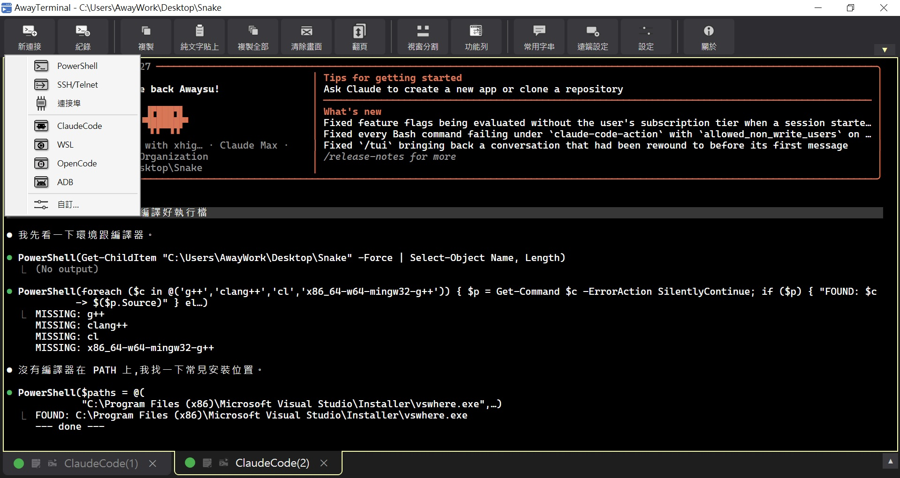
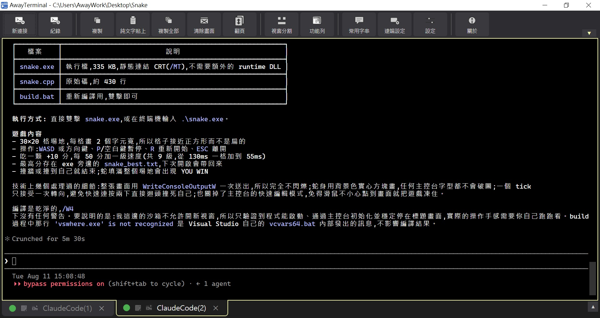
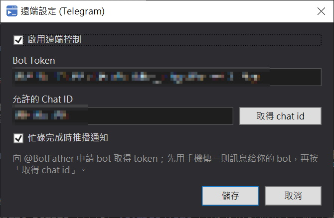

# AwayTerminal

AwayTerminal 是一套整合 AI Coding、Terminal 與遠端操作的 Windows 工具，讓工程師可以集中管理 Claude Code、Open Code、PowerShell、SSH、ADB、Serial COM、WSL 等工作環境實現多 Session 管理，常用字串可儲存常用指令與 AI Prompt，點選即可快速輸入到 Terminal，並可透過 Telegram 遠端功能操作。

技術上是 C# WPF (.NET 9) 原生外殼 + WebView2 內嵌 xterm.js 渲染終端機，連線層支援 ConPTY、內建 Telnet 與序列埠。

## 畫面

「新連接」下拉可直接開啟各種工作環境，右側分頁列表集中管理多個 Session（可拖曳調寬、右上 ▼/▲ 顯示隱藏）：



以 Claude Code 分頁進行 AI Coding，輸出保留在 scrollback 可自由捲動、搜尋與複製：



Telegram 遠端設定，設定完成後可用手機檢視畫面、下指令與接收完成通知：



## 特色

- **多 Session 管理**：PowerShell、SSH、Telnet、COM Port、ADB、WSL 與自訂連線（Claude Code、Open Code…）皆以分頁集中管理
- **AI Coding 友善**：Claude Code / Open Code 可直接以 ConPTY 執行，多行貼上、中文輸入與 scrollback 都已針對其 TUI 調校
- **常用字串**：儲存常用指令與 AI Prompt，可分群組，在「輸入文字」視窗選取後插入或直接送出（可設定送出後自動按 Enter）
- **輸入文字**：工具列「輸入文字」開輸入框，中文、多行文字先在一般文字框打好再整段送進目前分頁（避開 AI TUI 逐鍵解析中文輸入的問題）；視窗上方可直接挑常用字串插入或送出
- **Telegram 遠端控制**：手機端檢視畫面、下指令、截圖與完成通知
- **檢視彈性**：分頁 / 分割 / 分欄三種模式
- **可自訂**：字型、配色（可逐分頁）、Ctrl+滾輪縮放、連線歷史與開機恢復分頁
- **分頁恢復含畫面紀錄**：關閉時勾「恢復分頁」，下次開啟會先把上次的畫面內容倒回分頁再連線；SSH / Telnet / COM 斷線後按 Enter 在同一分頁重連，舊訊息留在 scrollback
- **檔案總管整合**：資料夾右鍵「用 AwayTerminal 開啟」，直接在該目錄開 PowerShell 分頁（已開啟的 AwayTerminal 會直接加分頁）
- **終端機功能**：記錄 log、Ctrl+F 搜尋、複製 / 純文字貼上 / 緩衝區匯出檔案
- **Tera Term `.ttl` 巨集**的部分指令支援
- 內建繁體中文與英文介面

## 系統需求

- Windows 10 / Windows 11
- .NET 9 SDK（開發與建置用）
- Microsoft Edge WebView2 Runtime

## 下載

安裝檔請至 [awaysu/Download](https://github.com/awaysu/Download) 取得。

## 快速開始

```powershell
git clone https://github.com/awaysu/AwayTerminal.git
cd AwayTerminal
dotnet build
.\bin\Debug\net9.0-windows\AwayTerminal.exe
```

## 專案結構

```text
AwayTerminal.csproj        專案設定與相依套件
MainWindow.xaml/.cs        主視窗、工具列、分頁與終端機控制
ConPty/                    Windows ConPTY 連線實作
Sessions/                  Telnet、Serial 與終端機 Session 介面
Dialogs/                   各種設定與連線對話框
Services/                  設定、診斷、遠端控制等服務
Logging/                   終端機記錄
Macros/                    TTL 巨集執行器
Localization/              多語系字串
web/                       WebView2 前端與 xterm.js 資源
installer/                 Inno Setup 安裝檔腳本
msix/                      MSIX 打包資源
```

## 建置安裝檔

一般發佈可先產生 Release publish：

```powershell
dotnet publish -c Release -r win-x64 --self-contained false
```

安裝檔腳本位於 `installer/installer.iss`，MSIX 打包腳本位於 `msix/build-msix.ps1`。

## 授權

本專案採用 [MIT License](LICENSE) — Copyright (c) 2026, Chih-Wei Su (Awaysu)。第三方元件授權請參考 `THIRD-PARTY-NOTICES.md`。
